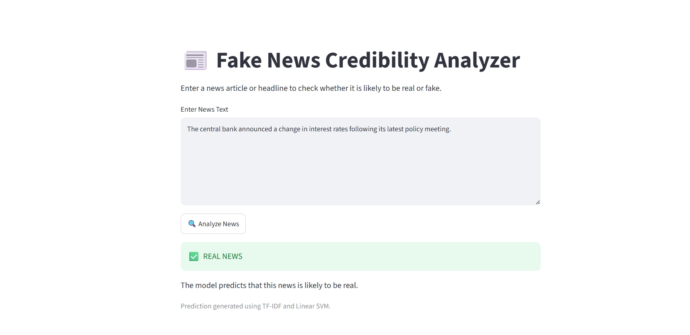
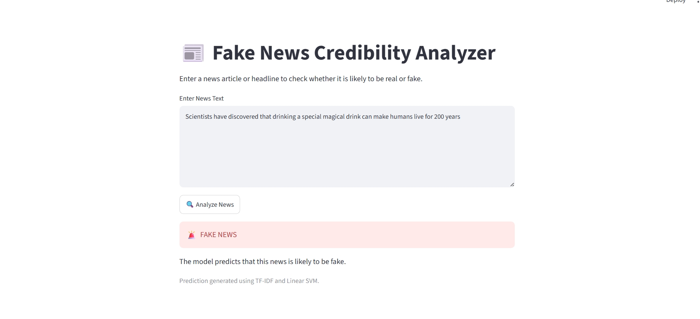

# Fake News Credibility Analyzer

A machine learning project that classifies news articles as **Real** or **Fake** using Natural Language Processing (NLP).

## Project Overview

This project uses labeled news articles to train machine learning models for fake news classification.

The workflow includes:

- Dataset preparation and exploration
- Text preprocessing
- TF-IDF feature extraction
- Logistic Regression classification
- Linear SVM classification
- Model evaluation
- Confusion matrix analysis
- Model comparison
- Prediction of new/unseen news text

## Dataset

The project uses a labeled news dataset containing:

- **23,481** fake news articles
- **21,417** real news articles
- **44,898** articles in total

Each article contains information such as title, article text, subject, and publication date.

## Technologies Used

- Python
- Pandas
- NumPy
- Scikit-learn
- Matplotlib
- Natural Language Processing (NLP)
- TF-IDF Vectorization
- Logistic Regression
- Linear Support Vector Machine (SVM)
- Jupyter Notebook / Google Colab

## Model Performance

Two classification models were evaluated:

| Model | Accuracy |
|---|---:|
| Logistic Regression | 98.69% |
| Linear SVM | 99.54% |

**Linear SVM achieved the best test accuracy of 99.54%.**

## Example Prediction

The project includes a prediction function that accepts new news text and classifies it as:

- `REAL NEWS`
- `FAKE NEWS`

Example:

```text
News: Scientists have discovered that drinking a special magical drink can make humans live for 200 years.

Prediction: FAKE NEWS
## Demo

The project includes an interactive Streamlit web application that allows users to enter a news article or headline and receive a prediction.

### Streamlit Application



### Prediction Example


